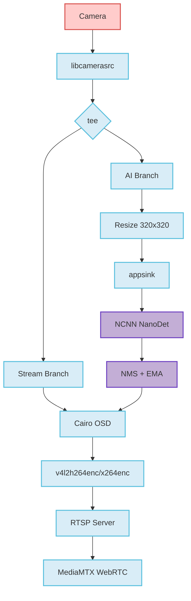

# NanoStream

> 🚀 Real-time AI-powered video streaming for Raspberry Pi 4B

A production-ready object detection and video streaming system featuring hardware-accelerated encoding, NCNN inference, and WebRTC support.

[](https://www.raspberrypi.com/)
[](https://gstreamer.freedesktop.org/)
[](https://github.com/Tencent/ncnn)
[](LICENSE)

---

## ✨ Features

- **🎯 Real-time Object Detection** - NCNN NanoDet inference at 30 FPS (320x320)
- **⚡ Hardware Acceleration** - V4L2 H.264 encoding with DMABUF zero-copy pipeline
- **📡 Dual Streaming** - RTSP + WebRTC support via MediaMTX
- **🎨 Live OSD Overlay** - Cairo-based detection visualization
- **🔧 Smart Fallback** - Automatic DMABUF to software pipeline fallback
- **📊 Multi-object Tracking** - IoU-based NMS with EMA smoothing
- **⚙️ INT8 Quantization** - 2-3x performance boost with INT8 models
- **🌡️ Thermal Throttling** - Adaptive AI throttling based on temperature

---

## 🚀 Quick Start

### Prerequisites

```bash
sudo apt update
sudo apt install -y cmake g++ \
    libgstreamer1.0-dev libgstreamer-plugins-base1.0-dev \
    libgstrtspserver-1.0-dev gstreamer1.0-libcamera \
    gstreamer1.0-plugins-ugly gstreamer1.0-tools \
    libcairo2-dev libcamera-tools
```

### Build & Run

```bash
# Install NCNN (optimized for RPi4)
chmod +x scripts/install_ncnn.sh && ./scripts/install_ncnn.sh

# Download NanoDet models
chmod +x scripts/download_models.sh && ./scripts/download_models.sh

# Build and run
sh scripts/build.sh
./build/NanoStream
```

### Access Stream

**RTSP (VLC/FFplay):**
```
rtsp://<raspberry-pi-ip>:8554/live
```

**WebRTC (Browser):**
```
http://<raspberry-pi-ip>:8889/
```

---

## ⚙️ Configuration

All settings are controlled via environment variables:

### Pipeline Settings
```bash
# Enable DMABUF zero-copy (default: 1)
NANOSTREAM_DMABUF=1

# Enable thermal throttling (default: 0)
NANOSTREAM_THERMAL=1

# Thermal thresholds (°C)
NANOSTREAM_THERMAL_HIGH=70
NANOSTREAM_THERMAL_CRIT=75
NANOSTREAM_THERMAL_SLEEP=500  # ms
```

### AI Settings
```bash
# Use INT8 quantized model (default: 0)
NANOSTREAM_INT8=1

# Custom INT8 model paths
NANOSTREAM_INT8_PARAM=models/nanodet_m-int8.param
NANOSTREAM_INT8_BIN=models/nanodet_m-int8.bin

# Detection parameters
NANOSTREAM_DET_SCORE_THRESH=0.35
NANOSTREAM_DET_TOPK=100
NANOSTREAM_DET_IOU_THRESH=0.4

# Show class labels on OSD (default: 1)
NANOSTREAM_LABELS=1
```

### Network Settings
```bash
# RTSP server host (default: auto-detected)
NANOSTREAM_RTSP_HOST=0.0.0.0

# Enable debug logging (default: 0)
NANOSTREAM_DEBUG=1
```

### Example Usage
```bash
# High-performance mode with INT8
NANOSTREAM_INT8=1 NANOSTREAM_THERMAL=1 ./build/NanoStream

# Debug mode with custom thresholds
NANOSTREAM_DEBUG=1 NANOSTREAM_DET_SCORE_THRESH=0.5 ./build/NanoStream
```

---

## 📊 Performance

**Raspberry Pi 4B @ 1.5GHz**

| Component | Resolution | Performance |
|-----------|-----------|-------------|
| Camera Capture | 640x480 | 30 FPS |
| Hardware Encoding | 640x480 H.264 | < 5% CPU |
| AI Inference (FP32) | 320x320 | ~130ms |
| AI Inference (INT8) | 320x320 | ~90ms |
| Total System Load | - | Stable, no backlog |

---

## 🏗️ Architecture



**Key Design Principles:**
- **Async Architecture** - Streaming and AI run independently
- **Leaky Queues** - AI branch drops frames under load, streaming stays smooth
- **Zero-copy Pipeline** - DMABUF minimizes CPU overhead
- **Smart Fallback** - Auto-detects hardware capabilities

---

## 🛠️ Advanced Topics

### WebRTC Deployment

Deploy MediaMTX for WebRTC streaming:

```bash
cd deploy/mediamtx
docker-compose up -d
```

Access at: `http://<raspberry-pi-ip>:8889/`

Configuration files:
- `deploy/mediamtx/docker-compose.yml`
- `deploy/mediamtx/mediamtx.yml`
- `deploy/mediamtx/webrtc-simple.html`

### INT8 Model Calibration

Generate custom INT8 calibration table:

```bash
# Capture calibration images
./scripts/capture_calib.sh

# Use ncnn2table tool to generate calibration
# See: https://github.com/Tencent/ncnn/tree/master/tools/quantize
```

### Troubleshooting

**STREAMON Error (No such process)**
- DMABUF memory alignment conflict
- Solution: Automatic fallback to software pipeline enabled

**RTSP Connection Drops**
- Missing H.264 byte-stream headers
- Solution: Already configured with `h264parse config-interval=1`

**Pipeline Freezes**
- Multiple branches waiting for sync
- Solution: All sinks configured with `async=false`

**Check DMABUF Status**
```bash
# Remove disable flag to retry DMABUF
rm ~/.nanostream_dmabuf_disabled
```

---

## 📚 Documentation

- **[P1 Checklist](docs/P1.md)** - OSD implementation guide
- **[P2 Performance](docs/P2_PERF.md)** - Hardware encoding benchmarks
- **[Implementation Plan](PLAN.md)** - Future optimization roadmap
- **[Agent Workflow](AGENTS.md)** - Development process documentation

---

## 🎯 Detection Features

### Supported Classes
80 COCO classes including: person, bicycle, car, motorcycle, bus, truck, cat, dog, and more.

### Detection Pipeline
1. **Multi-scale Head Processing** - Nodes 792, 814, 839 (NanoDet architecture)
2. **Distribution Focal Loss Decoding** - 4×8 bins regression
3. **IoU-based NMS** - Spatial deduplication
4. **EMA Smoothing** - Temporal stability (reduces jitter)
5. **Size-adaptive Thresholds** - Better small object handling
6. **False Positive Filtering** - Enhanced person detection accuracy

---

## 🔮 Roadmap

- [ ] YOLOv8/v10 tiny model support
- [ ] Multi-camera input
- [ ] Cloud recording integration
- [ ] Mobile app companion
- [ ] Edge TPU support
- [ ] Dynamic resolution switching

---

## 📄 License

MIT License - see [LICENSE](LICENSE) for details.

---

## 🙏 Acknowledgments

- [Tencent/ncnn](https://github.com/Tencent/ncnn) - High-performance neural network inference framework
- [RangiLyu/nanodet](https://github.com/RangiLyu/nanodet) - Super fast and lightweight anchor-free object detection
- [GStreamer Project](https://gstreamer.freedesktop.org/) - Multimedia framework
- [MediaMTX](https://github.com/bluenviron/mediamtx) - Real-time media server

---

<p align="center">
  Made with ❤️ for edge AI
</p>
