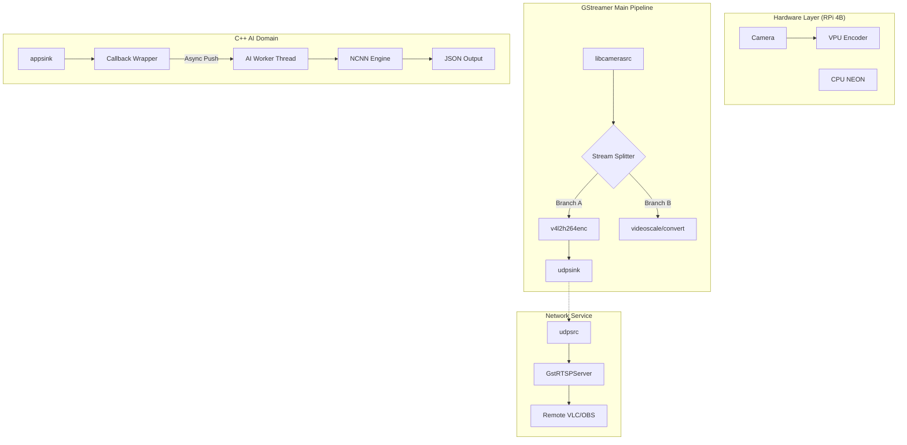

# NanoStream-Raspberry4B
> **极致边缘流控**: 基于 NCNN 与 GStreamer 的高性能异步实时检测系统

本项目旨在通过 C++ 与 GStreamer 的极致调优，在 Raspberry Pi 4B 上实现 **1080p/720p 零延迟推流** 与 **实时 AI 目标检测** 的完美并行。

---

## 🚀 核心特性

- **硬件加速 (Offloading)**: 
    - 采用 `v4l2h264enc` 硬件编码器，将 H.264 编码压力从 CPU 转移到 VPU。
    - 针对 ARM NEON 指令集优化的 NCNN 推理。
- **异步双轨架构**:
    - **推流轨**: 满帧运行，不因 AI 运算延迟而产生丢帧或卡顿。
    - **AI 轨**: 独立 Worker Thread 运行，采用“尽力而为”策略，自动平衡性能。
- **工业级桥接**: 
    - 使用 RTP-UDP 内部环回桥接，确保主管道与 RTSP 服务器之间的高速、无锁数据交换。
- **结构化输出**: 
    - 实时输出 JSON 格式的检测元数据（Metadata），方便对接业务系统。

## 🏗 系统架构



---

## 🛠 安装与部署

### 1. 系统依赖
```bash
sudo apt update
sudo apt install -y cmake g++ libgstreamer1.0-dev libgstreamer-plugins-base1.0-dev \
    libgstrtspserver-1.0-dev gstreamer1.0-libcamera gstreamer1.0-plugins-ugly \
    gstreamer1.0-tools libcamera-tools
```

### 2. 构建 NCNN 与模型
```bash
# 执行自动化安装脚本 (针对 RPi4 优化编译)
chmod +x scripts/install_ncnn.sh && ./scripts/install_ncnn.sh

# 下载 NanoDet-m 模型
chmod +x scripts/download_models.sh && ./scripts/download_models.sh
```

### 3. 编译运行
```bash
sh scripts/build.sh
./build/NanoStream
```

---

## 📺 远程接入
在客户端（Mac/PC/手机）打开 VLC，输入以下地址：
`rtsp://<RaspberryPi_IP>:8554/live`

**网络调优提示**:
1. **防火墙**: 确保执行了 `sudo ufw disable` 或放行了 `8554` 和 `5004` 端口。
2. **连接模式**: 若 UDP 画面撕裂，请在 VLC 设置中勾选 **"RTP over RTSP (TCP)"**。

---

## 🧩 疑难排查 (Troubleshooting)

在本项目开发过程中，我们攻克了以下关键技术坑位，供后来者参考：

1. **STREAMON 错误 (No such process)**:
   - **起因**: `libcamerasrc` 输出的硬件 DMABUF 与 `v4l2h264enc` 直接对接时，在特定内核下会发生内存对齐冲突。
   - **对策**: 在 `tee` 后增加 `videoconvert ! video/x-raw,format=I420` 强制转入系统内存，虽然损失极小 CPU 但换取了绝对的稳定性。
2. **Pipeline Preroll 死锁**:
   - **起因**: 多分支 Pipeline 默认会等待所有分支准备就绪（预卷），若推流端未连上或 AI 运算过慢，整个管道会停滞。
   - **对策**: 在所有 Sink 端开启 `async=false`。
3. **RTSP 连接秒断**:
   - **起因**: UDP 桥接时没有提供正确的 H.264 Byte-Stream (Annex-B) 头信息。
   - **对策**: 显式指定 `h264parse config-interval=1` 并强制输出 `stream-format=byte-stream`。

---

## 📊 性能指标 (RPi 4B @ 1.5GHz)
| 模块 | 分辨率 | 负载/延迟 |
| :--- | :--- | :--- |
| 摄像头采集 | 1280x720 | 30 FPS |
| 硬件编码 (VPU) | 720p | < 5% CPU |
| AI 推理 (NCNN) | 320x320 | ~90ms - 130ms |
| 综合流控 | - | 稳定、零积压 |

---

## 📜 许可证
MIT License.

## 🤝 鸣谢
- [Tencent/ncnn](https://github.com/Tencent/ncnn)
- [RangiLyu/nanodet](https://github.com/RangiLyu/nanodet)
- [GStreamer Project](https://gstreamer.freedesktop.org/)
