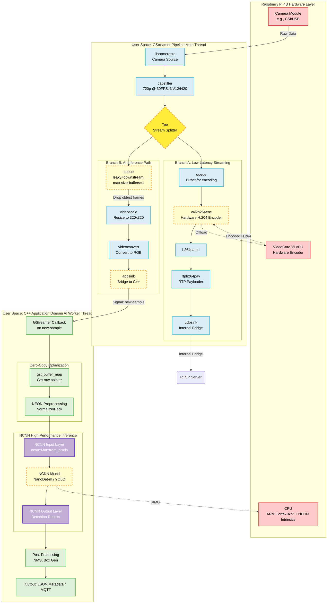

# NanoStream-Raspberry4B
> **极致边缘流控**: 基于 NCNN 与 GStreamer 的高性能异步实时检测系统

本项目旨在通过 C++ 与 GStreamer 的极致调优，在 Raspberry Pi 4B 上实现 **1080p/720p 零延迟推流** 与 **实时 AI 目标检测** 的完美并行。

---

## 🚀 核心特性

- **硬件加速 (Offloading)**: 
    - 采用 `v4l2h264enc` 硬件编码器，将 H.264 编码压力从 CPU 转移到 VPU。
    - 针对 ARM NEON 指令集优化的 NCNN 推理。
- **异步双轨架构**:
    - **推流轨**: 满帧运行，不因 AI 运算延迟而产生丢帧或卡顿。
    - **AI 轨**: 独立 Worker Thread 运行，采用“尽力而为”策略，自动平衡性能。
- **工业级桥接**: 
    - 使用 RTP-UDP 内部环回桥接，确保主管道与 RTSP 服务器之间的高速、无锁数据交换。
- **结构化输出**: 
    - 实时输出 JSON 格式的检测元数据（Metadata），方便对接业务系统。

## 🏗 系统架构



---

## 🛠 安装与部署

### 1. 系统依赖
```bash
sudo apt update
sudo apt install -y cmake g++ libgstreamer1.0-dev libgstreamer-plugins-base1.0-dev \
    libgstrtspserver-1.0-dev gstreamer1.0-libcamera gstreamer1.0-plugins-ugly \
    gstreamer1.0-tools libcamera-tools
```

### 2. 构建 NCNN 与模型
```bash
# 执行自动化安装脚本 (针对 RPi4 优化编译)
chmod +x scripts/install_ncnn.sh && ./scripts/install_ncnn.sh

# 下载 NanoDet-m 模型
chmod +x scripts/download_models.sh && ./scripts/download_models.sh
```

### 3. 编译运行
```bash
sh scripts/build.sh
./build/NanoStream
```

---

## 📺 远程接入
在客户端（Mac/PC/手机）打开 VLC，输入以下地址：
`rtsp://<RaspberryPi_IP>:8554/live`

**网络调优提示**:
1. **防火墙**: 确保执行了 `sudo ufw disable` 或放行了 `8554` 和 `5004` 端口。
2. **连接模式**: 若 UDP 画面撕裂，请在 VLC 设置中勾选 **"RTP over RTSP (TCP)"**。

---

## 🧩 疑难排查 (Troubleshooting)

在本项目开发过程中，我们攻克了以下关键技术坑位，供后来者参考：

1. **STREAMON 错误 (No such process)**:
   - **起因**: `libcamerasrc` 输出的硬件 DMABUF 与 `v4l2h264enc` 直接对接时，在特定内核下会发生内存对齐冲突。
   - **对策**: 在 `tee` 后增加 `videoconvert ! video/x-raw,format=I420` 强制转入系统内存，虽然损失极小 CPU 但换取了绝对的稳定性。
2. **Pipeline Preroll 死锁**:
   - **起因**: 多分支 Pipeline 默认会等待所有分支准备就绪（预卷），若推流端未连上或 AI 运算过慢，整个管道会停滞。
   - **对策**: 在所有 Sink 端开启 `async=false`。
3. **RTSP 连接秒断**:
   - **起因**: UDP 桥接时没有提供正确的 H.264 Byte-Stream (Annex-B) 头信息。
   - **对策**: 显式指定 `h264parse config-interval=1` 并强制输出 `stream-format=byte-stream`。

---

## 📈 未来改进与优化清单

为了实现更高性能的边缘计算产品，我们制定了详细的 [实施方案 (PLAN.md)](./PLAN.md)。以下是核心方向：

1. **VPU 硬件链路深度调优**: 
    - 目前通过 `videoconvert` 规避了内存对齐问题。下一步将探索使用 `v4l2convert` 的硬件缩放/转换能力，或尝试 `dmabuf` 零拷贝直接注入编码器，旨在彻底解放 CPU。
2. **AI 精度与量化提升**:
    - 制作针对树莓派 4B 硬件环境的专属 INT8 量化表（PTQ），在保持当前 100ms 左右延迟的前提下进一步提升检测精度。
3. **可视化叠加 (OSD)**:
    - 目前检测结果仅以 JSON 形式输出。计划集成 `cairooverlay` 或 `rsvgoverlay`，将 AI 预测框实时绘制并合并到推流中。
4. **动态负载平衡 (Dynamic FPS)**:
    - 根据系统实时温度和 CPU 负载，动态调整 AI 推理分支的跳帧策略，确保在极端环境下推流轨道始终满帧。
5. **多模型适配支持**:
    - 增加对 YOLO-v8/v10-tiny 的适配，提供不同场景下的推理权重选择。
6. **WebRTC 支持**:
    - 探索集成网页端的低延迟播放支持，实现无需客户端软件的实时监控。

---

## ✅ P1 交付指南
详细的 P1 执行清单、验收标准与测试步骤见：
`docs/P1.md`

### WebRTC 旁路部署（MediaMTX）
模板位于：
`deploy/mediamtx`

---

## 📝 本次 dev 合并摘要
- NanoDet-m 解码修复：支持 1 通道 cls/reg 分布式回归（reg_max=7，4x8 bins），正确输出 bbox。
- 稳定性提升：阈值上调、近邻去重收紧、候选 cap 限制，减少重复/抖动框；禁用 packing layout，完善头部诊断日志。
- WebRTC 兼容：本地播放器兼容 path 参数与多端点；MediaMTX 端口避冲突。
- 安全性：appsink caps/size 防护，OSD 安全绘制；gitignore 更新。

## ✅ 本次 dev 更新（新）
- 检测稳定性：改为多目标 IOU 关联 + EMA 平滑，减少跳框；同类过多框进行自适应限制。
- 误报抑制：按目标面积自适应阈值，小目标更严格；person 误报过滤增强。
- 多类标签：支持 COCO 类别名显示，`NANOSTREAM_LABELS=0` 关闭标签。
- P2 零拷贝：DMABUF 双路径尝试（v4l2convert 与 direct），运行期自动回退。
- P2 温控降频：`NANOSTREAM_THERMAL=1` 启用；阈值可通过 `NANOSTREAM_THERMAL_HIGH/CRIT/SLEEP` 配置。
- DMABUF 禁用标记：失败后生成 `~/.nanostream_dmabuf_disabled`，后续自动走软件管线。
- P2 性能对比记录模板：`docs/P2_PERF.md`

## 📊 性能指标 (RPi 4B @ 1.5GHz)
| 模块 | 分辨率 | 负载/延迟 |
| :--- | :--- | :--- |
| 摄像头采集 | 1280x720 | 30 FPS |
| 硬件编码 (VPU) | 720p | < 5% CPU |
| AI 推理 (NCNN) | 320x320 | ~90ms - 130ms |
| 综合流控 | - | 稳定、零积压 |

---

## 📜 许可证
MIT License.

## 🤝 鸣谢
- [Tencent/ncnn](https://github.com/Tencent/ncnn)
- [RangiLyu/nanodet](https://github.com/RangiLyu/nanodet)
- [GStreamer Project](https://gstreamer.freedesktop.org/)
