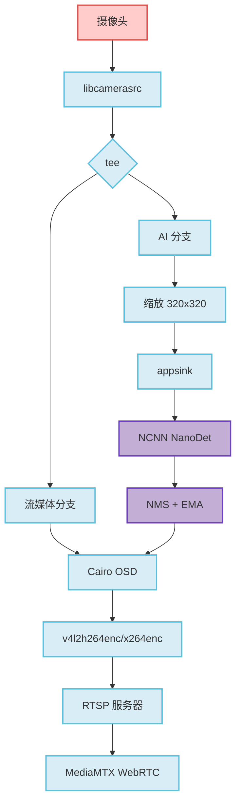

# NanoStream

> 🚀 树莓派 4B 实时 AI 视频流系统

生产级物体检测和视频流系统，支持硬件加速编码、NCNN 推理和 WebRTC 流媒体。

[](https://www.raspberrypi.com/)
[](https://gstreamer.freedesktop.org/)
[](https://github.com/Tencent/ncnn)
[](LICENSE)

---

## ✨ 特性

- **🎯 实时物体检测** - NCNN NanoDet 推理，30 FPS (320x320)
- **⚡ 硬件加速** - V4L2 H.264 编码，DMABUF 零拷贝管道
- **📡 双重流媒体** - 通过 MediaMTX 支持 RTSP + WebRTC
- **🎨 实时 OSD 叠加** - 基于 Cairo 的检测可视化
- **🔧 智能回退** - DMABUF 到软件管道的自动回退
- **📊 多目标追踪** - 基于 IoU 的 NMS 和 EMA 平滑
- **⚙️ INT8 量化** - INT8 模型带来 2-3 倍性能提升
- **🌡️ 温控限流** - 基于温度的自适应 AI 限流

---

## 🚀 快速开始

### 系统依赖

```bash
sudo apt update
sudo apt install -y cmake g++ \
    libgstreamer1.0-dev libgstreamer-plugins-base1.0-dev \
    libgstrtspserver-1.0-dev gstreamer1.0-libcamera \
    gstreamer1.0-plugins-ugly gstreamer1.0-tools \
    libcairo2-dev libcamera-tools
```

### 编译与运行

```bash
# 安装 NCNN (针对树莓派 4 优化)
chmod +x scripts/install_ncnn.sh && ./scripts/install_ncnn.sh

# 下载 NanoDet 模型
chmod +x scripts/download_models.sh && ./scripts/download_models.sh

# 编译并运行
sh scripts/build.sh
./build/NanoStream
```

### 访问流媒体

**RTSP (VLC/FFplay):**
```
rtsp://<树莓派IP>:8554/live
```

**WebRTC (浏览器):**
```
http://<树莓派IP>:8889/
```

---

## ⚙️ 配置

所有设置通过环境变量控制：

### 管道设置
```bash
# 启用 DMABUF 零拷贝 (默认: 1)
NANOSTREAM_DMABUF=1

# 启用温控限流 (默认: 0)
NANOSTREAM_THERMAL=1

# 温度阈值 (°C)
NANOSTREAM_THERMAL_HIGH=70
NANOSTREAM_THERMAL_CRIT=75
NANOSTREAM_THERMAL_SLEEP=500  # ms
```

### AI 设置
```bash
# 使用 INT8 量化模型 (默认: 0)
NANOSTREAM_INT8=1

# 自定义 INT8 模型路径
NANOSTREAM_INT8_PARAM=models/nanodet_m-int8.param
NANOSTREAM_INT8_BIN=models/nanodet_m-int8.bin

# 检测参数
NANOSTREAM_DET_SCORE_THRESH=0.35
NANOSTREAM_DET_TOPK=100
NANOSTREAM_DET_IOU_THRESH=0.4

# 在 OSD 上显示类别标签 (默认: 1)
NANOSTREAM_LABELS=1
```

### 网络设置
```bash
# RTSP 服务器主机地址 (默认: 自动检测)
NANOSTREAM_RTSP_HOST=0.0.0.0

# 启用调试日志 (默认: 0)
NANOSTREAM_DEBUG=1
```

### 使用示例
```bash
# 高性能模式 (INT8)
NANOSTREAM_INT8=1 NANOSTREAM_THERMAL=1 ./build/NanoStream

# 调试模式，自定义阈值
NANOSTREAM_DEBUG=1 NANOSTREAM_DET_SCORE_THRESH=0.5 ./build/NanoStream
```

---

## 📊 性能

**树莓派 4B @ 1.5GHz**

| 组件 | 分辨率 | 性能 |
|-----------|-----------|-------------|
| 摄像头采集 | 640x480 | 30 FPS |
| 硬件编码 | 640x480 H.264 | < 5% CPU |
| AI 推理 (FP32) | 320x320 | ~130ms |
| AI 推理 (INT8) | 320x320 | ~90ms |
| 系统总负载 | - | 稳定，无积压 |

---

## 🏗️ 架构



**核心设计原则：**
- **异步架构** - 流媒体和 AI 独立运行
- **漏队列** - AI 分支在负载下丢帧，保持流媒体流畅
- **零拷贝管道** - DMABUF 最小化 CPU 开销
- **智能回退** - 自动检测硬件能力

---

## 🛠️ 高级主题

### WebRTC 部署

部署 MediaMTX 以支持 WebRTC 流媒体：

```bash
cd deploy/mediamtx
docker-compose up -d
```

访问地址：`http://<树莓派IP>:8889/`

配置文件：
- `deploy/mediamtx/docker-compose.yml`
- `deploy/mediamtx/mediamtx.yml`
- `deploy/mediamtx/webrtc-simple.html`

### INT8 模型校准

生成自定义 INT8 校准表：

```bash
# 捕获校准图像
./scripts/capture_calib.sh

# 使用 ncnn2table 工具生成校准
# 详见：https://github.com/Tencent/ncnn/tree/master/tools/quantize
```

### 故障排除

**STREAMON 错误 (No such process)**
- DMABUF 内存对齐冲突
- 解决方案：已启用自动回退到软件管道

**RTSP 连接断开**
- 缺少 H.264 字节流头
- 解决方案：已配置 `h264parse config-interval=1`

**管道冻结**
- 多个分支等待同步
- 解决方案：所有 sink 已配置 `async=false`

**检查 DMABUF 状态**
```bash
# 移除禁用标志以重试 DMABUF
rm ~/.nanostream_dmabuf_disabled
```

---

## 📚 文档

- **[P1 检查清单](docs/P1.md)** - OSD 实现指南
- **[P2 性能](docs/P2_PERF.md)** - 硬件编码基准测试
- **[实现计划](PLAN.md)** - 未来优化路线图
- **[Agent 工作流](AGENTS.md)** - 开发流程文档

---

## 🎯 检测特性

### 支持的类别
80 个 COCO 类别，包括：人、自行车、汽车、摩托车、公交车、卡车、猫、狗等。

### 检测管道
1. **多尺度头处理** - 节点 792、814、839 (NanoDet 架构)
2. **分布焦点损失解码** - 4×8 bins 回归
3. **基于 IoU 的 NMS** - 空间去重
4. **EMA 平滑** - 时间稳定性 (减少抖动)
5. **尺寸自适应阈值** - 更好的小目标处理
6. **误报过滤** - 增强的人体检测精度

---

## 🔮 路线图

- [ ] 支持 YOLOv8/v10 tiny 模型
- [ ] 多摄像头输入
- [ ] 云录制集成
- [ ] 移动应用配套
- [ ] Edge TPU 支持
- [ ] 动态分辨率切换

---

## 📄 许可证

MIT License - 详见 [LICENSE](LICENSE) 文件。

---

## 🙏 致谢

- [Tencent/ncnn](https://github.com/Tencent/ncnn) - 高性能神经网络推理框架
- [RangiLyu/nanodet](https://github.com/RangiLyu/nanodet) - 超快速轻量级无锚点物体检测
- [GStreamer Project](https://gstreamer.freedesktop.org/) - 多媒体框架
- [MediaMTX](https://github.com/bluenviron/mediamtx) - 实时媒体服务器

---

<p align="center">
  用 ❤️ 为边缘 AI 打造
</p>
